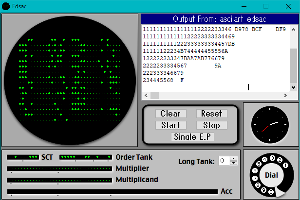

# EDSAC 用 ASCIIART

Mandelbrot 集合を描画するベンチマーク
[ASCIIART](http://haserin09.la.coocan.jp/asciiart.html)
の EDSAC (機械語)版。

## EDSAC について

EDSAC は最初期のプログラム内蔵式電子計算機であり、実用に供されたものとしては最初のものと言って良いと思われる。
操作の様子が
[EDSAC(YouTube)](https://www.youtube.com/watch?v=6v4Juzn10gM&feature=youtu.be)で見られる。
初期の電子計算機で EDSAC の設計を出発点としたものは多く、
パラメトロン計算機 PC-1 もその一つと言える。
(したがって ASCIIART の PC-1 からの移植は比較的容易だった。)

## 操作方法

EDSAC のシミュレータを[The EDSAC Simulator](https://www.dcs.warwick.ac.uk/~edsac/)
からダウンロードし、インストールする。

メニューウィンドウの左上のプルダウンで "Initial Orders 2" が選択されていることを確認し、
"File" メニューから

* [asciiart_edsac.txt](asciiart_edsac.txt) または
* [asciiart_edsac_withoutcomments.txt](asciiart_edsac_withoutcomments.txt)

を読み込む。"Start" ボタンで実行する。

シミュレータの時計によると 24 分 40 秒、そのうち読み込みに 20 秒程度かかっている。

