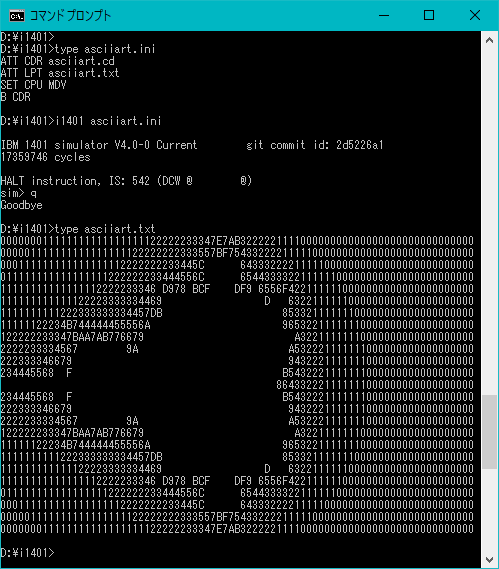

# IBM 1401 用 ASCIIART

Mandelbrot 集合を(主にBASICで)描画するベンチマーク
[ASCIIART](http://haserin09.la.coocan.jp/asciiart.html)
を、IBM 1401 の機械語で書いてみた。

## IBM 1401 について

IBM 1401 は、1959 年に発表され、大ヒットとなったトランジスター製
電子計算機である。
Computer History Museum の [ibm-1401.info](http://ibm-1401.info/)
に大量の情報がある。
また、Ken Shirriff 氏の
[12-minute Mandelbrot: fractals on a 50 year old IBM 1401 mainframe](http://www.righto.com/2015/03/12-minute-mandelbrot-fractals-on-50.html)
が面白い。


## 操作方法

[asciiart.ini](asciiart.ini), [asciiart.cd](asciiart.cd) をカレントディレクトリにおいて、
[simh](http://simh.trailing-edge.com/) の i1401 で、

```
i1401 asciiart.ini
```

のように実行する。

## 実行結果、速度

.

simh の i1401 に少しコードを付け加えてサイクル数を計測してみた。
[ver. 4.0 からの diff](i1401_cpu.c.diff)(それ以前でも多分あまり変わらない。)
simh 本体にもいつか入れてもらいたいところだが、まずは simh 全体の構造を勉強中。

これを信用すれば、ASCIIART は 175359746 サイクルで、"CPU Time" としては 199.6 秒ということになる。
(Ken Shirriff 氏の Mandelbrot は 63490467 サイクル、730.1 秒となった。
実機で 12 分ということなので、大体信用できそうである。)

一般的な命令のサイクル数については
[Reference Manual](http://bitsavers.trailing-edge.com/pdf/ibm/1401/A24-1403-5_1401_Reference_Apr62.pdf)を、
乗算のサイクル数については
[IBM 1401 Data Processing System Optional Features](http://ibm-1401.info/IBM1401-225-6541-0_1401_Optional_Features_CE_Apr61.pdf)
を参考にした。

入出力については、カード読み込みが 1 分で 800 枚だから 90 枚で 6.75 秒程度(改善の余地あり)、プリンターは 1 分に 600 行だが、CPU の待ち時間はプリンタバッファを付けていれば 1 行で 2ms なのでほぼ無視してよい。

